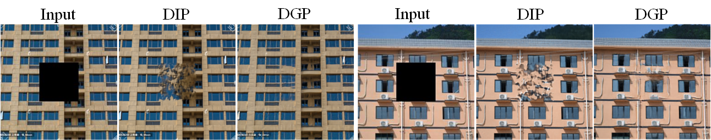

## Deep Generative Prior (DGP) in Inpainting

pretrained 모델 집어넣는 법
- `pretrained/` 폴더에 모델 삽입 (pth 파일)

파라미터 수정 하는 법
- `experiments/run_inpainting_list.sh` 파일 내부에 세팅 값들을 변경한다.

모델 실행 하는 법
- `sh experiments/run_inpainting_list.sh`

image 테스트 하는 법
두 입력 이미지가 필요하다. (1. 마스크 이미지(흑백) / 2. 마스크가 적용된 그림 이미지)
- `data/others/image/` 에 이미지를 넣는다.
- `data/others/mask/` 에 위 이미지에 해당하는 마스크 이미지를 넣는다.

마스크와 마스크된 이미지는 이름명을 **같게** 해준다.

그리고 `data/others` 폴더에 있는 `list.txt`에서 넣은 이미지명을 넣어준다. 

(ex. images_252.png
images_291.png
images_299.png)


--- 
original README >>>


### Paper

Xingang Pan, Xiaohang Zhan, Bo Dai, Dahua Lin, Chen Change Loy, Ping Luo, "[Exploiting Deep Generative Prior for Versatile Image Restoration and Manipulation](https://arxiv.org/abs/2003.13659)", ECCV2020 (**Oral**)  

Video: https://youtu.be/p7ToqtwfVko<br>

### Demos

DGP exploits the image prior of an off-the-shelf GAN for various image restoration and manipulation.

**Image restoration**:

<p align="center">
    
</p>

**Image manipulation**:

<p align="center">
    
</p>

A **learned prior** helps **internal learning**:

<p align="center">
    
</p>

### Requirements

* python>=3.6
* pytorch>=1.0.1
* others

    ```sh
    pip install -r requirements.txt
    ```

### Get Started

Before start, please download the pretrained BigGAN at [Google drive](https://drive.google.com/drive/folders/1buQ2BtbnUhkh4PEPXOgdPuVo2iRK7gvI?usp=sharing) or [Baidu cloud](https://pan.baidu.com/s/10GKkWt7kSClvhnEGQU4ckA) (password: uqtw), and put them to `pretrained` folder.

Example1: run image colorization example:
    
    sh experiments/examples/run_colorization.sh   

The results will be saved in `experiments/examples/images` and `experiments/examples/image_sheet`.

Example2: process images with an image list:
    
    sh experiments/examples/run_inpainting_list.sh   

Example3: evaluate on 1k ImageNet validation images via distributed training based on [slurm](https://slurm.schedmd.com/):

    # need to specifiy the root path of imagenet validate set in --root_dir
    sh experiments/imagenet1k_128/colorization/train_slurm.sh   

Note:  
\- BigGAN needs a class condition as input. If no class condition is provided, it would be chosen from a set of random samples.  
\- The hyperparameters provided may not be optimal, feel free to tune them.  

### Acknowledgement

The code of BigGAN is borrowed from [https://github.com/ajbrock/BigGAN-PyTorch](https://github.com/ajbrock/BigGAN-PyTorch).

### Citation

```  
@inproceedings{pan2020dgp,
  author = {Pan, Xingang and Zhan, Xiaohang and Dai, Bo and Lin, Dahua and Loy, Chen Change and Luo, Ping},
  title = {Exploiting Deep Generative Prior for Versatile Image Restoration and Manipulation},
  booktitle = {European Conference on Computer Vision (ECCV)},
  year = {2020}
}
```  
